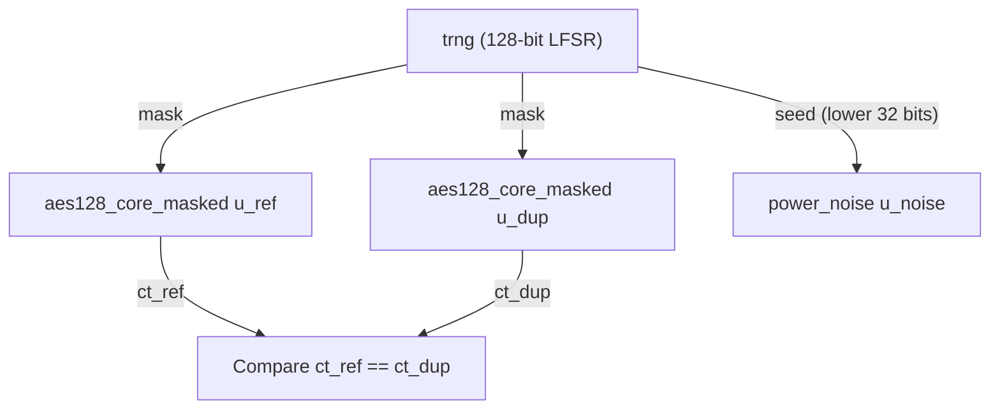

# 6424

## Hardening Features

The AES-128 core has been hardened against both fault-injection and side-channel attacks:


1.  **First-Order Boolean Masking**: The `aes128_core_masked` module implements Boolean masking for all sensitive intermediate values. This ensures that real state bytes and unmasked S-box outputs never appear in the clear on any wire, providing resistance against first-order power and EM side-channel analysis (DPA/CPA).
    - **Init Phase**: Each encryption begins with a **256-cycle precomputation phase** where a masked S-box table (`masked_sbox[z] = S(z ^ r) ^ r`) is built using a fresh 128-bit mask.
    - **Linear Layer Masking**: The mask is tracked through ShiftRows and MixColumns using the mathematical property that `F(state ^ mask) = F(state) ^ F(mask)` for linear functions `F`.

2.  **True Random Number Generator (TRNG)**: A 128-bit LFSR-based TRNG provides a fresh, unpredictable mask for every encryption. This mask is latched on the `start` pulse to ensure independence from the key and plaintext.

3.  **Fault Detection (Redundancy)**: The top-level `aes128_hardened_top` instantiates two identical masked cores (ref and dup) and compares their ciphertexts. Any mismatch (e.g., from a laser glitch or EM fault) triggers a `fault_alert`.

4.  **Power Noise Generation**: An unpredictable seed from the TRNG feeds a noise generator that toggles extra logic during encryption to add non-deterministic power noise, further obfuscating the side-channel trace.

### Latency and Performance
- **Total Latency**: 266 cycles per encryption (256 cycles for S-box masking init + 10 rounds).
- **Correctness**: The unmasking at the final round ensures the external `ciphertext` output remains perfectly compatible with the standard AES-128-ECB specification.

---

## AES correctness validation (OpenSSL reference)

Correctness is demonstrated by comparing the RTL AES output to a trusted reference: **OpenSSL** AES-128-ECB.

### Flow

1. **Generate test vectors** — `gen_vectors.py` produces random (key, plaintext) pairs and uses OpenSSL to compute the expected ciphertext:
   ```bash
   openssl enc -aes-128-ecb -K <key_hex> -nosalt -nopad -in <plain> -out <cipher>
   ```
   It writes `key_hex plain_hex openssl_cipher_hex` per line to `tb/generated_vectors.txt`.

2. **Run simulation** — The testbench `tb_aes_hardened.sv` drives the RTL with each (key, plaintext), reads the expected ciphertext from that file, and compares the RTL output to the OpenSSL result. Any mismatch causes a fatal failure.

3. **One command** — From the repo root, run:
   ```bash
   ./run_validation.sh
   ```
   This regenerates vectors with OpenSSL, compiles the testbench, runs the simulation, and prints PASS if all RTL outputs match the OpenSSL reference.

**Requirements:** `python3`, OpenSSL, and Icarus Verilog (`iverilog`). Install with e.g. `sudo apt install iverilog` if needed.
